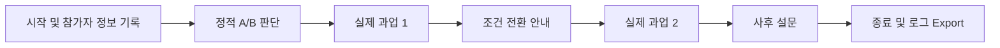
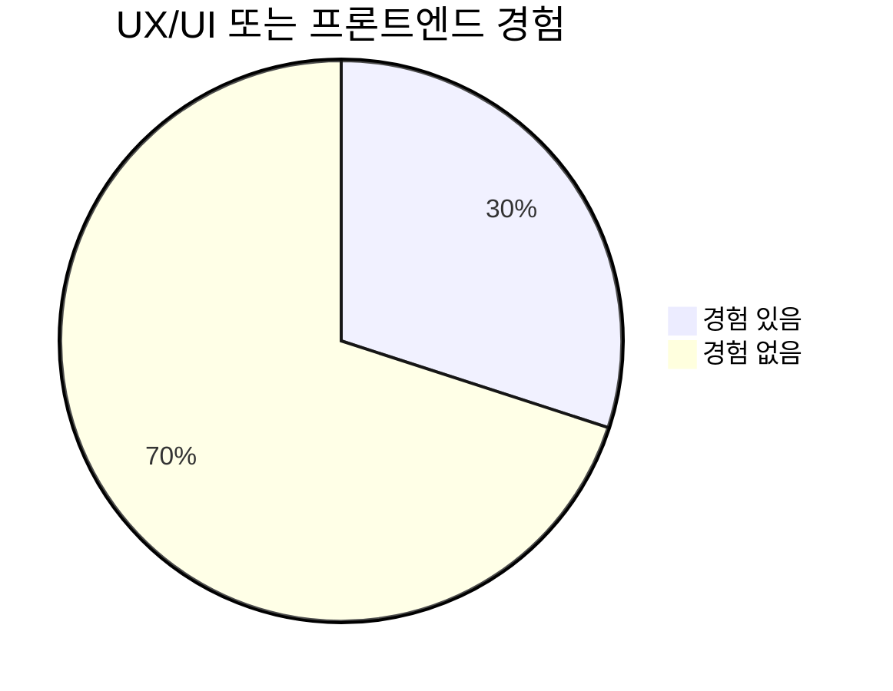
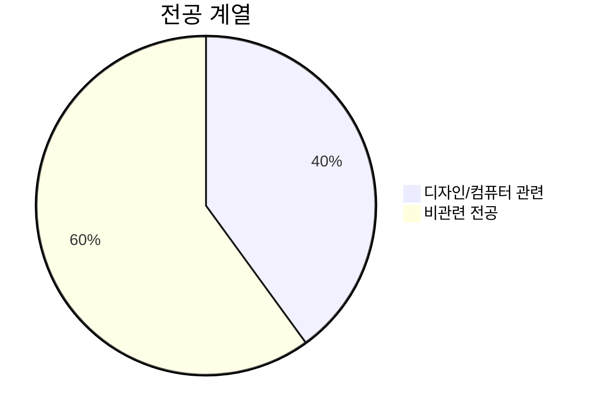
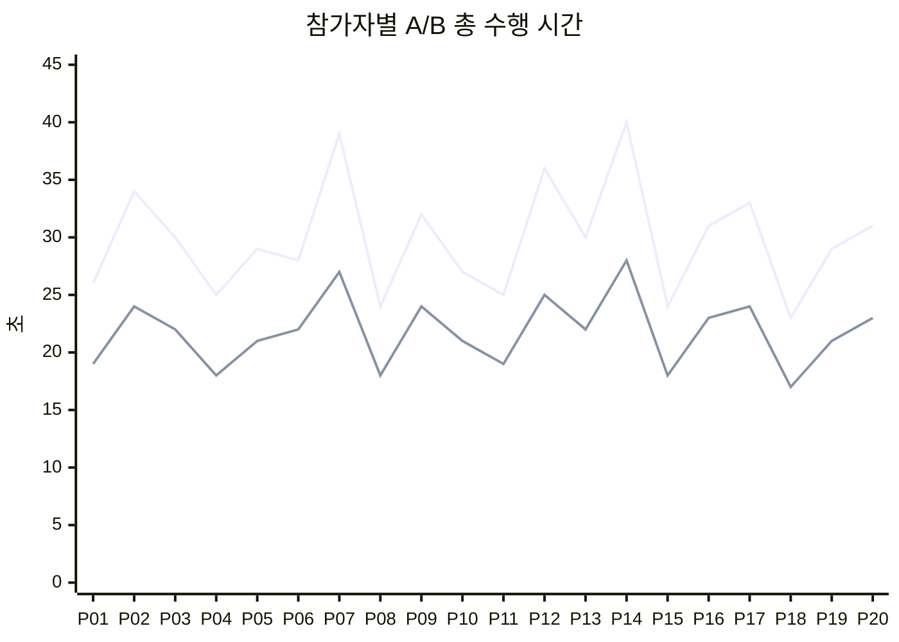

# UI 원칙 실효성 검증 User Study 보고서

> 데이터 성격: 본 문서는 `study_results/`의 가상 합성 데이터셋을 바탕으로 작성한 분석 보고서입니다. 실제 운영 시에는 동일한 설계와 지표 구조로 수집된 로그/설문 데이터로 대체할 수 있습니다.

## 0. 한 줄 요약

본 연구는 **정적 판단, 실제 과업 수행, 사후 설문**을 함께 비교하여, 가이드라인 기반 UI가 단순히 좋아 보이는 수준을 넘어 실제 수행 효율과 명확성을 개선하는지 검토했다. 합성 데이터 기준으로 조건 B는 조건 A보다 평균 과업 시간이 8.0초 짧고, 성공률은 85%에서 100%로 높았으며, 사후 설문에서도 입력 명확성, 선택 비교 용이성, CTA 예측 가능성, 전체 편의성에서 모두 더 높은 점수를 보였다.

---

## 1. 실험 설계

### 1.1 연구 질문

1. 가이드라인 기반 UI는 실제 상호작용에서도 더 나은 수행 결과를 만드는가?
2. 사용자가 정적으로 더 좋다고 판단한 UI와 실제로 더 잘 수행한 UI는 일치하는가?
3. 사용자가 사후에 도움이 되었다고 말한 요소와 로그상 성과를 만든 요소는 일치하는가?

### 1.2 핵심 주장

> 좋은 UI는 보기만 해서 판단할 수 있는가, 아니면 실제로 써봐야 알 수 있는가?

본 실험은 단순 선호도 조사가 아니라, **정적 인상 → 실제 행동 → 사후 해석**을 함께 비교한다. 따라서 “좋아 보이는 UI”와 “실제로 수행을 잘 돕는 UI”가 일치하는지, 또는 어디서 어긋나는지를 확인할 수 있다.

### 1.3 실험 조건

| 가이드라인 | 조건 A: 비가이드라인형 | 조건 B: 가이드라인형 | 기대 효과 |
|---|---|---|---|
| G1. 입력 필드 | placeholder만 제공 | 항상 보이는 label 제공 | 입력 중에도 필드 의미를 유지해 오류와 재확인을 줄임 |
| G2. 옵션 선택 | Dropdown | Radio Button | 선택지를 한 번에 비교해 선택 시간과 재선택을 줄임 |
| G3. CTA 문구 | `다음`, `확인` | `플랜 선택 완료`, `카드 결제로 회원가입 완료`, `간편결제로 구독 시작하기` | 버튼 클릭 후 결과 예측 가능성을 높이고 망설임을 줄임 |

### 1.4 실험 흐름



정적 판단은 항상 실제 과업 전에 진행했다. 이유는 정적 판단을 “사용 전 첫인상”으로 측정하기 위해서다. 실제 과업을 먼저 수행하면 참가자의 판단에는 이미 사용 경험이 섞이므로, 연구 질문인 “정적 판단과 실제 수행의 일치 여부”를 해석하기 어려워진다.

### 1.5 Counterbalancing

실제 과업은 within-subject 방식으로 진행하며, 각 참가자가 조건 A와 조건 B를 모두 경험한다. 단, 순서 효과와 시나리오 난이도 효과를 줄이기 위해 4개 그룹으로 균형 배정한다.

| 그룹 | 인원 | 실제 과업 1 | 실제 과업 2 |
|---|---:|---|---|
| G1 | 5명 | A + S1 학생/카드 | B + S2 프리미엄/간편 |
| G2 | 5명 | B + S1 학생/카드 | A + S2 프리미엄/간편 |
| G3 | 5명 | A + S2 프리미엄/간편 | B + S1 학생/카드 |
| G4 | 5명 | B + S2 프리미엄/간편 | A + S1 학생/카드 |

### 1.6 과업 시나리오

과업 지시문은 입력, 선택, 확인 화면에 계속 표시했다. 다만 참가자 화면에는 “목표 플랜: Student”처럼 정답을 직접 표시하지 않았다. 따라서 단기 기억 능력이 아니라 **정보 비교, 목표 매칭, 제출 의미 해석**을 측정하도록 설계했다.

| 시나리오 | 지시문 | 정답 플랜 | 정답 결제 |
|---|---|---|---|
| S1 `student-card` | 학생 인증이 가능하며 월 비용을 가장 낮추고 싶습니다. 카드 결제로 가입을 완료하세요. | Student | 신용/체크카드 |
| S2 `premium-simple` | 팀원과 함께 사용할 예정이며 저장공간이 가장 큰 플랜이 필요합니다. 간편결제로 구독을 시작하세요. | Premium | 간편결제 |

### 1.7 수집 지표

| 분류 | 지표 | 해석 목적 |
|---|---|---|
| 행동 로그 | 성공 여부 | 목표 플랜/결제 조합을 올바르게 선택했는지 |
| 행동 로그 | 입력 단계 시간 | label 유무가 입력 수행에 미치는 영향 |
| 행동 로그 | 선택 단계 시간 | dropdown/radio가 비교 비용에 미치는 영향 |
| 행동 로그 | 확인 단계 시간 | 확인 화면에서 검토에 걸린 전체 시간 |
| 행동 로그 | CTA 클릭 지연 | CTA 문구가 클릭 망설임에 미치는 영향 |
| 행동 로그 | 입력 오류 수 | placeholder-only로 인한 입력 오류 가능성 |
| 행동 로그 | 옵션 재선택 수 | 선택 방식이 재탐색/수정에 미치는 영향 |
| 정적 판단 | A/B 선택, 확신도, 이유 | 사용 전 첫인상 |
| 사후 설문 | 조건별 입력/선택/CTA/전체 편의성 점수 | 실제 사용 후 주관 평가 |
| 사후 설문 | 차이 인지, 생각 변화, 추가 의견 | 인지된 효과와 실제 로그의 관계 |

**확인 단계 시간과 CTA 클릭 지연의 차이**  
확인 단계 시간은 확인 화면에 머문 전체 시간이다. CTA 클릭 지연은 CTA가 보인 뒤 실제 클릭까지 걸린 시간이다. 현재 프로토타입에서는 CTA가 화면 진입 직후 보이므로 두 값이 가깝지만, 보고서에서는 확인 단계 시간은 과업 단계 분해용, CTA 클릭 지연은 버튼 문구 효과 분석용으로 구분한다.

---

## 2. 실험 결과

### 2.1 참가자 구성

총 20명의 가상 참가자를 4개 그룹에 5명씩 배정했다. UX/UI 또는 프론트엔드 경험자는 6명, 디자인/컴퓨터 관련 전공자는 8명이며, 디지털 서비스 숙련도 평균은 4.95/7이다.





| ID | 그룹 | 실제 과업 순서 | 전공 계열 | UX/FE 경험 | 숙련도 | 가입/결제 빈도 |
|---|---|---|---|---|---:|---|
| P01 | G1 | A S1 → B S2 | 디자인/컴퓨터 | 있음 | 6 | 높음 |
| P02 | G2 | B S1 → A S2 | 비관련 | 없음 | 4 | 중간 |
| P03 | G3 | A S2 → B S1 | 비관련 | 없음 | 5 | 중간 |
| P04 | G4 | B S2 → A S1 | 디자인/컴퓨터 | 있음 | 6 | 높음 |
| P05 | G1 | A S1 → B S2 | 비관련 | 없음 | 5 | 높음 |
| P06 | G2 | B S1 → A S2 | 디자인/컴퓨터 | 없음 | 5 | 중간 |
| P07 | G3 | A S2 → B S1 | 비관련 | 없음 | 3 | 낮음 |
| P08 | G4 | B S2 → A S1 | 디자인/컴퓨터 | 있음 | 7 | 높음 |
| P09 | G1 | A S1 → B S2 | 비관련 | 없음 | 4 | 중간 |
| P10 | G2 | B S1 → A S2 | 비관련 | 없음 | 5 | 높음 |
| P11 | G3 | A S2 → B S1 | 디자인/컴퓨터 | 있음 | 6 | 중간 |
| P12 | G4 | B S2 → A S1 | 비관련 | 없음 | 4 | 낮음 |
| P13 | G1 | A S1 → B S2 | 디자인/컴퓨터 | 없음 | 5 | 중간 |
| P14 | G2 | B S1 → A S2 | 비관련 | 없음 | 3 | 낮음 |
| P15 | G3 | A S2 → B S1 | 디자인/컴퓨터 | 있음 | 6 | 높음 |
| P16 | G4 | B S2 → A S1 | 비관련 | 없음 | 5 | 중간 |
| P17 | G1 | A S1 → B S2 | 비관련 | 없음 | 4 | 중간 |
| P18 | G2 | B S1 → A S2 | 디자인/컴퓨터 | 있음 | 7 | 높음 |
| P19 | G3 | A S2 → B S1 | 비관련 | 없음 | 5 | 중간 |
| P20 | G4 | B S2 → A S1 | 비관련 | 없음 | 4 | 중간 |

### 2.2 정적 판단 결과

정적 판단에서는 전반적으로 조건 B가 더 많이 선택되었다. 다만 옵션 선택 방식에서는 dropdown을 “깔끔하다”고 본 참가자가 일부 있어, 정적 판단과 실제 수행의 불일치 분석에 유의미한 지점이 생겼다.

| 항목 | A 선택 | B 선택 | B 선택률 |
|---|---:|---:|---:|
| 입력 필드 | 2 | 18 | 90% |
| 옵션 선택 | 6 | 14 | 70% |
| CTA 문구 | 1 | 19 | 95% |

```mermaid
xychart-beta
    title "정적 판단에서 조건 B 선택 인원"
    x-axis ["입력 필드", "옵션 선택", "CTA 문구"]
    y-axis "인원" 0 --> 20
    bar "B 선택" [18, 14, 19]
    bar "A 선택" [2, 6, 1]
```



| ID | 입력 필드 | 옵션 선택 | CTA 문구 | 정적 판단 메모 |
|---|---|---|---|---|
| P01 | B | B | B | 정보가 계속 보이는 UI가 검토하기 쉬워 보임 |
| P02 | B | A | B | dropdown이 첫인상에서는 깔끔해 보임 |
| P03 | B | B | B | 전반적으로 B가 더 명확해 보임 |
| P04 | B | B | B | label, radio, 명확 CTA를 선호 |
| P05 | B | A | B | 옵션은 A가 더 단순해 보임 |
| P06 | B | B | B | B가 흐름을 더 잘 설명한다고 판단 |
| P07 | A | A | B | 단순한 화면을 일부 선호 |
| P08 | B | B | B | 비교 정보가 보이는 B 선호 |
| P09 | B | B | B | B가 더 안정적으로 보임 |
| P10 | B | B | A | CTA는 `확인`만으로 충분하다고 판단 |
| P11 | B | B | B | 명확한 안내 선호 |
| P12 | A | A | B | A가 익숙하고 단순해 보임 |
| P13 | B | B | B | B가 더 친절해 보임 |
| P14 | B | B | B | 화면은 밀도 있어도 radio가 더 명확해 보임 |
| P15 | B | B | B | 전반적으로 B 선호 |
| P16 | B | B | B | B가 선택 실수 방지에 좋아 보임 |
| P17 | B | A | B | dropdown이 시각적으로 더 깔끔해 보임 |
| P18 | B | B | B | B가 더 명확하다고 판단 |
| P19 | B | B | B | B 선호 |
| P20 | B | A | B | 옵션 선택은 dropdown이 간결해 보임 |

### 2.3 실제 과업 수행 결과

조건 B는 모든 참가자에게서 조건 A보다 더 짧은 총 수행 시간을 보였다. 조건 A에서는 3명의 실패가 있었고, 조건 B에서는 실패가 없었다.

| ID | A 성공 | B 성공 | A 입력 | A 선택 | A 확인 | A 총합 | B 입력 | B 선택 | B 확인 | B 총합 | A 오류 | B 오류 | A 재선택 | B 재선택 | A CTA초 | B CTA초 |
|---|---|---|---:|---:|---:|---:|---:|---:|---:|---:|---:|---:|---:|---:|---:|---:|
| P01 | 성공 | 성공 | 12 | 10 | 4 | 26 | 9 | 7 | 3 | 19 | 0 | 0 | 0 | 0 | 2.2 | 1.1 |
| P02 | 실패 | 성공 | 14 | 15 | 5 | 34 | 10 | 10 | 4 | 24 | 1 | 0 | 1 | 0 | 3.1 | 1.4 |
| P03 | 성공 | 성공 | 13 | 13 | 4 | 30 | 9 | 9 | 4 | 22 | 0 | 0 | 0 | 0 | 2.4 | 1.3 |
| P04 | 성공 | 성공 | 11 | 10 | 4 | 25 | 8 | 7 | 3 | 18 | 0 | 0 | 0 | 0 | 2.0 | 1.0 |
| P05 | 성공 | 성공 | 13 | 12 | 4 | 29 | 9 | 8 | 4 | 21 | 0 | 0 | 0 | 0 | 2.3 | 1.2 |
| P06 | 성공 | 성공 | 12 | 12 | 4 | 28 | 10 | 9 | 3 | 22 | 0 | 0 | 0 | 0 | 2.1 | 1.3 |
| P07 | 실패 | 성공 | 17 | 17 | 5 | 39 | 12 | 11 | 4 | 27 | 1 | 0 | 1 | 0 | 3.5 | 1.7 |
| P08 | 성공 | 성공 | 10 | 10 | 4 | 24 | 8 | 7 | 3 | 18 | 0 | 0 | 0 | 0 | 1.9 | 0.9 |
| P09 | 성공 | 성공 | 14 | 14 | 4 | 32 | 10 | 10 | 4 | 24 | 0 | 0 | 0 | 0 | 2.7 | 1.5 |
| P10 | 성공 | 성공 | 12 | 11 | 4 | 27 | 9 | 8 | 4 | 21 | 0 | 0 | 0 | 0 | 2.2 | 1.2 |
| P11 | 성공 | 성공 | 10 | 11 | 4 | 25 | 8 | 8 | 3 | 19 | 0 | 0 | 0 | 0 | 2.0 | 1.1 |
| P12 | 실패 | 성공 | 16 | 15 | 5 | 36 | 11 | 10 | 4 | 25 | 1 | 0 | 1 | 0 | 3.2 | 1.6 |
| P13 | 성공 | 성공 | 13 | 13 | 4 | 30 | 9 | 9 | 4 | 22 | 0 | 0 | 0 | 0 | 2.5 | 1.3 |
| P14 | 성공 | 성공 | 18 | 17 | 5 | 40 | 12 | 12 | 4 | 28 | 1 | 1 | 0 | 0 | 3.6 | 1.8 |
| P15 | 성공 | 성공 | 10 | 10 | 4 | 24 | 8 | 7 | 3 | 18 | 0 | 0 | 0 | 0 | 1.9 | 0.9 |
| P16 | 성공 | 성공 | 13 | 14 | 4 | 31 | 10 | 9 | 4 | 23 | 0 | 0 | 0 | 0 | 2.6 | 1.4 |
| P17 | 성공 | 성공 | 15 | 14 | 4 | 33 | 10 | 10 | 4 | 24 | 1 | 0 | 1 | 0 | 2.8 | 1.5 |
| P18 | 성공 | 성공 | 10 | 9 | 4 | 23 | 7 | 7 | 3 | 17 | 0 | 0 | 0 | 0 | 1.8 | 0.8 |
| P19 | 성공 | 성공 | 12 | 13 | 4 | 29 | 9 | 8 | 4 | 21 | 0 | 0 | 0 | 0 | 2.2 | 1.2 |
| P20 | 성공 | 성공 | 13 | 14 | 4 | 31 | 10 | 9 | 4 | 23 | 0 | 0 | 0 | 0 | 2.5 | 1.4 |

### 2.4 개인별 A/B 시간 비교

전체 평균만 보면 개인의 숙련도 차이가 섞일 수 있다. 따라서 각 참가자 안에서 A와 B의 차이를 비교했다. 모든 참가자에게서 B가 더 빠르게 나타났으며, 평균 단축률은 26.59%였다.



| ID | A 총합 | B 총합 | 개인 전체 | B 단축초 | 단축률 |
|---|---:|---:|---:|---:|---:|
| P01 | 26 | 19 | 45 | 7 | 26.9% |
| P02 | 34 | 24 | 58 | 10 | 29.4% |
| P03 | 30 | 22 | 52 | 8 | 26.7% |
| P04 | 25 | 18 | 43 | 7 | 28.0% |
| P05 | 29 | 21 | 50 | 8 | 27.6% |
| P06 | 28 | 22 | 50 | 6 | 21.4% |
| P07 | 39 | 27 | 66 | 12 | 30.8% |
| P08 | 24 | 18 | 42 | 6 | 25.0% |
| P09 | 32 | 24 | 56 | 8 | 25.0% |
| P10 | 27 | 21 | 48 | 6 | 22.2% |
| P11 | 25 | 19 | 44 | 6 | 24.0% |
| P12 | 36 | 25 | 61 | 11 | 30.6% |
| P13 | 30 | 22 | 52 | 8 | 26.7% |
| P14 | 40 | 28 | 68 | 12 | 30.0% |
| P15 | 24 | 18 | 42 | 6 | 25.0% |
| P16 | 31 | 23 | 54 | 8 | 25.8% |
| P17 | 33 | 24 | 57 | 9 | 27.3% |
| P18 | 23 | 17 | 40 | 6 | 26.1% |
| P19 | 29 | 21 | 50 | 8 | 27.6% |
| P20 | 31 | 23 | 54 | 8 | 25.8% |

### 2.5 사후 설문 결과

18명은 조건 B를 더 편한 조건으로 응답했고, 2명은 두 조건이 비슷했다고 응답했다. 실제 서비스에서 사용하고 싶은 조건은 20명 모두 B를 선택했다. “화면만 보고 판단했을 때와 실제 사용 후 생각이 달라졌는가”에는 8명이 그렇다고 답했다.

| ID | 더 편한 조건 | 사용 희망 | 입력 A/B | 선택 A/B | CTA A/B | 전체 A/B | 차이 인지 | 가장 큰 차이 | 가장 도움 | 생각 변화 | 변화 내용 | 추가 의견 |
|---|---|---|---|---|---|---|---:|---|---|---|---|---|
| P01 | B | B | 5/7 | 4/7 | 5/7 | 5/7 | 6 | 옵션 | 옵션 | 아니오 | - | Radio buttons made comparison easier. |
| P02 | B | B | 4/6 | 4/6 | 4/6 | 4/6 | 5 | 옵션 | 옵션 | 예 | Dropdown looked clean but radio was easier in use. | Seeing all options at once helped. |
| P03 | B | B | 5/6 | 5/6 | 4/6 | 4/6 | 5 | 옵션 | 옵션 | 아니오 | - | Condition B was less confusing overall. |
| P04 | B | B | 5/7 | 5/7 | 5/7 | 5/7 | 6 | 입력 | 입력 | 아니오 | - | Persistent labels felt stable. |
| P05 | B | B | 5/6 | 4/6 | 5/6 | 5/6 | 5 | 옵션 | 옵션 | 예 | Dropdown looked simple but radio was easier for comparison. | Condition B felt more helpful. |
| P06 | B | B | 5/6 | 5/6 | 5/6 | 5/6 | 5 | 옵션 | 옵션 | 아니오 | - | Selection information was easier to inspect. |
| P07 | B | B | 3/5 | 3/5 | 3/5 | 3/5 | 6 | 입력 | 입력 | 예 | Simple-looking A became less clear during actual input. | I had to re-check field meanings in A. |
| P08 | 비슷 | B | 6/7 | 6/7 | 6/7 | 6/7 | 4 | CTA | CTA | 아니오 | - | Both were easy but B was more explicit. |
| P09 | B | B | 4/6 | 5/6 | 4/6 | 4/6 | 5 | 옵션 | 옵션 | 아니오 | - | Radio was better for comparing choices. |
| P10 | B | B | 5/6 | 5/6 | 4/6 | 5/6 | 4 | CTA | CTA | 예 | Confirm seemed enough at first but explicit copy felt safer. | CTA difference was small but noticeable. |
| P11 | B | B | 5/7 | 5/7 | 5/7 | 5/7 | 6 | 입력 | 입력 | 아니오 | - | Condition B was clearer overall. |
| P12 | B | B | 3/5 | 3/5 | 3/5 | 3/5 | 6 | 옵션 | 옵션 | 예 | A looked familiar but actual selection was easier in B. | I hesitated with dropdown. |
| P13 | B | B | 4/6 | 5/6 | 4/6 | 4/6 | 5 | 옵션 | 옵션 | 아니오 | - | Visible comparison information helped. |
| P14 | B | B | 3/4 | 3/4 | 3/4 | 3/4 | 5 | 입력 | 입력 | 예 | A looked simple but guidance was insufficient. | B was still not hard but better. |
| P15 | B | B | 6/7 | 6/7 | 6/7 | 6/7 | 5 | 옵션 | 옵션 | 아니오 | - | Difference was clear although the task was easy. |
| P16 | B | B | 4/6 | 5/6 | 4/6 | 4/6 | 5 | CTA | CTA | 아니오 | - | Button text felt clearer. |
| P17 | B | B | 4/6 | 4/6 | 4/6 | 4/6 | 5 | 옵션 | 옵션 | 예 | Dropdown looked cleaner but radio was faster in practice. | Option comparison was the key difference. |
| P18 | 비슷 | B | 6/7 | 6/7 | 6/7 | 6/7 | 4 | CTA | CTA | 아니오 | - | As an experienced user both were easy. |
| P19 | B | B | 5/6 | 5/6 | 4/6 | 5/6 | 5 | 입력 | 입력 | 아니오 | - | Labels felt more stable. |
| P20 | B | B | 4/6 | 4/6 | 4/6 | 4/6 | 5 | 옵션 | 옵션 | 예 | Dropdown looked concise but radio was better for comparison. | Condition B reduced the chance of mistakes. |

---

## 3. 지표 분석 및 정보 추출

### 3.1 핵심 집계

| 지표 | 조건 A | 조건 B | 차이 |
|---|---:|---:|---:|
| 성공률 | 85% | 100% | +15%p |
| 평균 입력 단계 시간 | 12.90초 | 9.40초 | -3.50초 |
| 평균 선택 단계 시간 | 12.70초 | 8.75초 | -3.95초 |
| 평균 확인 단계 시간 | 4.20초 | 3.65초 | -0.55초 |
| 평균 과업 완료 시간 | 29.80초 | 21.80초 | -8.00초 |
| 평균 오류 수 | 0.25회 | 0.05회 | -0.20회 |
| 평균 재선택 수 | 0.20회 | 0.00회 | -0.20회 |
| 평균 CTA 클릭 지연 | 2.47초 | 1.28초 | -1.19초 |
| 평균 전체 편의성 점수 | 4.50/7 | 6.10/7 | +1.60 |

```mermaid
xychart-beta
    title "조건별 평균 단계 시간"
    x-axis ["입력", "선택", "확인", "전체"]
    y-axis "초" 0 --> 35
    bar "조건 A" [12.9, 12.7, 4.2, 29.8]
    bar "조건 B" [9.4, 8.75, 3.65, 21.8]
```

```mermaid
xychart-beta
    title "조건별 오류, 재선택, CTA 지연"
    x-axis ["오류 수", "재선택 수", "CTA 지연초"]
    y-axis "값" 0 --> 3
    bar "조건 A" [0.25, 0.20, 2.47]
    bar "조건 B" [0.05, 0.00, 1.28]
```

```mermaid
xychart-beta
    title "조건별 사후 설문 평균"
    x-axis ["입력 명확성", "선택 비교", "CTA 예측", "전체 편의성"]
    y-axis "점수" 0 --> 7
    bar "조건 A" [4.55, 4.60, 4.40, 4.50]
    bar "조건 B" [6.10, 6.10, 6.10, 6.10]
```







### 3.2 입력 필드 분석

조건 B는 입력 단계 평균 시간이 9.40초로 조건 A의 12.90초보다 3.50초 짧았다. 입력 명확성 사후 점수도 A 4.55점, B 6.10점으로 차이가 컸다.

**해석**  
항상 보이는 label은 입력 중에도 필드 의미를 유지한다. placeholder-only 조건은 입력을 시작하면 안내가 사라지기 때문에, 특히 숙련도가 낮은 참가자(P07, P12, P14)에게서 입력 시간이 늘거나 오류가 발생했다. 입력 필드에서는 정적 판단과 실제 수행이 대체로 일치했다.

### 3.3 옵션 선택 분석

조건 B는 선택 단계 평균 시간이 8.75초로 조건 A의 12.70초보다 3.95초 짧았다. 재선택 횟수도 A 평균 0.20회, B 평균 0.00회였다.

**해석**  
본 과업은 가격, 대상, 저장공간, 공유 여부를 비교해야 한다. Radio button은 모든 선택지를 한 번에 보여주므로 비교 비용이 낮다. 반면 dropdown은 첫인상에서는 깔끔해 보일 수 있지만, 실제 비교 과정에서는 선택지를 열고 확인해야 해서 시간이 늘어난다.

정적 판단에서 옵션 선택 B 비율은 70%로 입력/CTA보다 낮았다. 그러나 실제 수행에서는 모든 참가자에게서 B가 더 빠르게 나타났다. 이는 **정적으로 깔끔해 보이는 UI와 실제 수행에 유리한 UI가 다를 수 있음**을 보여준다.

### 3.4 CTA 분석

조건 B는 CTA 클릭 지연이 평균 1.28초로 조건 A의 2.47초보다 1.19초 짧았다. CTA 예측 가능성 점수도 A 4.40점, B 6.10점으로 차이가 나타났다.

**해석**  
CTA는 과업 성공률을 크게 바꾸기보다는, 버튼을 누른 뒤 어떤 일이 일어나는지 예측하게 하고 망설임을 줄이는 데 영향을 준다. 확인 화면의 제목과 설명을 중립화했기 때문에, 버튼 문구 자체의 명확성이 더 직접적으로 드러났다.

### 3.5 정적 판단과 실제 수행의 일치 여부

실제 수행에서 조건 B가 더 좋은 결과를 보였다고 볼 때, 정적 판단과 실제 수행이 불일치한 사례는 다음과 같다.

| 항목 | 정적 A 선택자 | 실제 우수 조건 | 불일치 사례 |
|---|---:|---|---:|
| 입력 필드 | 2명 | B | 2명 |
| 옵션 선택 | 6명 | B | 6명 |
| CTA 문구 | 1명 | B | 1명 |

**핵심 인사이트**  
불일치는 옵션 선택에서 가장 많이 나타났다. 이는 dropdown이 정적으로는 간결해 보일 수 있지만, 실제 비교 과업에서는 radio button이 더 효율적이라는 점을 보여준다.

### 3.6 사후 인식과 로그의 관계

사후 설문에서 가장 크게 느낀 차이와 가장 도움이 된 요소는 동일한 분포를 보였다.

| 요소 | 가장 큰 차이 | 가장 도움 |
|---|---:|---:|
| 입력 필드 | 5명 | 5명 |
| 옵션 선택 | 11명 | 11명 |
| CTA 문구 | 4명 | 4명 |

**해석**  
참가자들은 옵션 선택 방식의 차이를 가장 크게 인지했고, 로그에서도 선택 단계 시간이 가장 크게 줄었다. 입력 필드는 오류와 명확성에서, CTA는 클릭 지연과 예측 가능성에서 효과가 나타났다. 즉, 이번 데이터에서는 주관적 인식과 행동 로그가 대체로 같은 방향을 보였지만, 옵션 선택에서 가장 강한 효과가 나타났다는 점이 핵심이다.

### 3.7 최종 결론

1. 조건 B는 조건 A보다 평균 과업 완료 시간이 8.0초 짧았다.
2. 조건 B는 성공률, 오류 수, 재선택 수, CTA 클릭 지연에서 모두 더 나은 결과를 보였다.
3. 참가자별 paired comparison에서도 모든 참가자에게서 B가 더 빠르게 나타나, 개인 능력 차이를 고려해도 B의 우세가 일관적이었다.
4. 정적 판단과 실제 수행은 대체로 일치했지만, 옵션 선택에서는 일부 참가자가 A를 선호했음에도 실제 수행은 B에서 더 좋았다.
5. 따라서 가이드라인 기반 UI는 단순히 “좋아 보이는” 수준을 넘어 실제 수행 효율과 주관적 명확성을 개선할 가능성이 있다.

---

## 4. 발표자료 활용 요약

### 4.1 슬라이드 구성안

1. 연구 질문: 좋은 UI는 보기만 해서 판단할 수 있는가?
2. 실험 조건: placeholder vs label, dropdown vs radio, 확인 vs 명확 CTA
3. 실험 설계: 정적 판단 → 실제 과업 A/B → 사후 설문
4. Counterbalancing: G1~G4 구조
5. 수집 지표: 시간, 성공률, 오류, 재선택, CTA 지연, 사후 점수
6. 결과 1: 조건 B가 평균 8.0초 빠름
7. 결과 2: 옵션 선택에서 정적 판단과 실제 수행의 불일치 발생
8. 결과 3: 사후 설문에서도 B의 명확성/편의성 점수가 높음
9. 한계와 개선 방향
10. 결론: 실제 상호작용 로그를 함께 봐야 UI 품질을 더 정확히 평가할 수 있음

### 4.2 발표용 핵심 문장

> 조건 B는 조건 A보다 평균 완료 시간이 8초 짧았고, 모든 참가자에게서 B가 더 빠르게 나타났다. 특히 옵션 선택에서는 dropdown이 정적으로는 깔끔해 보일 수 있었지만, 실제 비교 과업에서는 radio button이 더 효율적이었다.

---

## 5. 예상 피드백과 대응책

| 예상 피드백 | 날카로운 지점 | 대응책 |
|---|---|---|
| 표본 수 20명으로 충분한가? | 통계적 일반화에는 부족할 수 있음 | 본 연구는 탐색적 HCI 프로젝트이며, within-subject 설계로 개인차를 줄였다. 향후 참가자 수를 늘려 통계 검정을 보강할 수 있다. |
| 실제 효과가 UI 때문인지 시나리오 때문인지 분리 가능한가? | 조건과 시나리오가 얽힐 수 있음 | G1~G4로 조건 순서와 시나리오 순서를 교차했다. 같은 조건이 두 시나리오에 모두 등장하게 설계했다. |
| B 조건은 세 요소가 모두 좋아져서 어느 요소 효과인지 알기 어렵지 않은가? | 입력, 옵션, CTA 효과가 결합됨 | 로그를 단계별로 나눠 입력 시간, 선택 시간, CTA 지연을 따로 측정했다. 단일 요소 효과를 더 엄밀히 보려면 후속 연구에서 factorial design을 사용할 수 있다. |
| 정적 판단을 먼저 하면 참가자가 차이를 의식하지 않는가? | demand characteristic 가능성 | 정적 첫인상을 측정하려면 과업 전 판단이 필요하다. 다만 이로 인한 의식화 효과는 한계로 인정하고, 향후 과업 먼저 그룹을 추가할 수 있다. |
| 과업이 너무 쉬운 것 아닌가? | 오류와 실패가 적어 효과가 작을 수 있음 | 과업 지시문은 계속 보여주되, 플랜 비교 조건을 넣어 단기 기억이 아니라 정보 비교 부담을 만들었다. 쉬운 과업에서도 CTA 지연과 선택 시간 차이가 나타난 점이 의미 있다. |
| CTA 효과가 약하지 않은가? | 최종 화면이라 어차피 누를 버튼이 명확함 | 확인 화면 안내를 중립화해 CTA 문구 자체가 행동 결과를 설명하도록 했다. CTA는 성공률보다 클릭 지연과 예측 가능성 점수로 해석했다. |
| 사후 설문은 기억에 의존하지 않는가? | A/B 순서 기억 혼동 가능성 | 조건 순서를 로그와 함께 저장하고, 설문에서 조건 A/B를 명시했다. 향후에는 각 과업 직후 미니 설문을 추가할 수 있다. |
| UX 경험자가 결과를 왜곡할 수 있지 않은가? | 전문성 차이 | 참가자 특성으로 UX/FE 경험과 숙련도를 기록했고, 그룹별로 편중되지 않게 배정했다. 분석 시 경험자/비경험자 하위 분석도 가능하다. |
| p-value 같은 통계 검정이 없는가? | 분석의 엄밀성 부족 | 현재는 평균, paired comparison, 오류/재선택 빈도 중심의 탐색 분석이다. 실제 보고서 확장 시 paired t-test 또는 Wilcoxon signed-rank test를 추가할 수 있다. |

---

## 6. 데이터 파일

분석에 사용한 CSV 파일은 `study_results/`에 있다.

- `participants.csv`: 참가자 정보
- `static_judgments.csv`: 정적 판단 결과
- `task_performance.csv`: 실제 과업 수행 로그 요약
- `individual_time_comparison.csv`: 개인별 A/B 시간 비교
- `post_survey.csv`: 사후 설문 결과
- `aggregate_summary.csv`: 핵심 집계표

---

## 7. 실행 방법

```bash
npm install
npm run dev
```

브라우저에서 `http://localhost:3000`에 접속한다.

---

## 8. 주요 디렉토리

```text
app/study/start       실험 설정 및 시작
app/study/static      정적 A/B 판단
app/study/signup      계정 정보 입력 과업
app/study/plan        플랜 및 결제 방식 선택 과업
app/study/confirm     최종 확인 및 CTA 클릭
app/study/transition  첫 번째 조건과 두 번째 조건 사이 안내
app/study/survey      사후 설문
app/study/end         종료 및 로그 export
context               실험 상태 관리
hooks                 로깅 훅
lib                   실험 상수, 시나리오, 로그 유틸
types                 실험/로그 타입
study_results         보고서용 CSV 데이터
```
